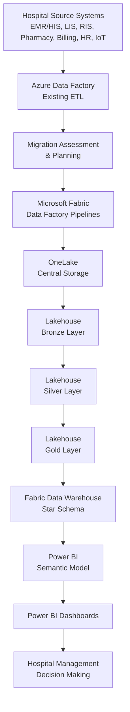

# Architecture — Hospital Management Analytics (ADF → Microsoft Fabric Migration)

> ⭐ Portfolio/demo project simulating a real-world ADF-to-Fabric migration 
> pattern for a hospital analytics platform. Built with synthetic data.

## End-to-End Flow

## Source Systems (Simulated)
- Electronic Medical Records (EMR/HIS)
- Patient Registration
- Laboratory Information System (LIS)
- Radiology System (RIS)
- Pharmacy Management
- Billing & Insurance
- HR & Payroll
- Appointment Scheduling

## ADF → Fabric Component Mapping

| Azure Data Factory | Microsoft Fabric |
|---|---|
| Pipeline | Fabric Data Factory Pipeline |
| Copy Activity | Copy Activity |
| Mapping Data Flow | Dataflow Gen2 |
| Dataset | OneLake / Lakehouse |
| Linked Service | Fabric Connection |
| Integration Runtime | Managed Gateway |
| Trigger | Schedule / Event Trigger |
| Monitoring | Fabric Monitoring Hub |

## Medallion Architecture (Lakehouse)

**Bronze Layer** — Raw data as-is
- patients.csv, admissions.csv, billing.csv, lab.csv, doctors.csv

**Silver Layer** — Cleaned & validated
- Remove duplicates
- Handle NULL values
- Standardize date/ID formats
- Validate patient IDs

**Gold Layer** — Business-ready, star schema
- `FactPatientVisits`, `FactBilling`, `FactPharmacySales`
- `DimPatient`, `DimDoctor`, `DimDepartment`, `DimDate`

## Data Warehouse — Star Schema

**Fact Tables**: FactAdmissions, FactBilling, FactLabTests, FactPharmacy, FactAppointments
**Dimension Tables**: DimPatient, DimDoctor, DimDepartment, DimDate, DimDiagnosis, DimInsurance

## Semantic Model — Key Measures
- Total Patients
- Revenue
- Bed Occupancy %
- Average Length of Stay
- Readmission Rate
- Pharmacy Revenue

Security: **Row-Level Security (RLS)**, **Incremental Refresh**

## Power BI Dashboards
| Dashboard | KPIs |
|---|---|
| Executive | Total Patients, Revenue, Occupancy, Profit |
| Patient | Admissions, Discharges, Length of Stay, Readmissions |
| Clinical | Diagnosis Trends, Lab Results, Infection Rate |
| Finance | Revenue, Claims, Outstanding Payments |
| Operations | Bed Utilization, Doctor Performance, OT Usage |

## Deployment Flow

Configured with: Scheduled Refresh, Deployment Pipelines, Monitoring, Alerts

## Governance & Monitoring
- Microsoft Fabric Monitoring Hub — pipeline runs, refresh failures, capacity usage
- Microsoft Purview — data lineage, sensitivity labels
- RBAC (Role-Based Access Control)

---
⭐ *This architecture mirrors a real-world ADF-to-Fabric migration pattern for 
hospital analytics, built here as a self-contained portfolio project using 
synthetic data — not real client/employer data.*
