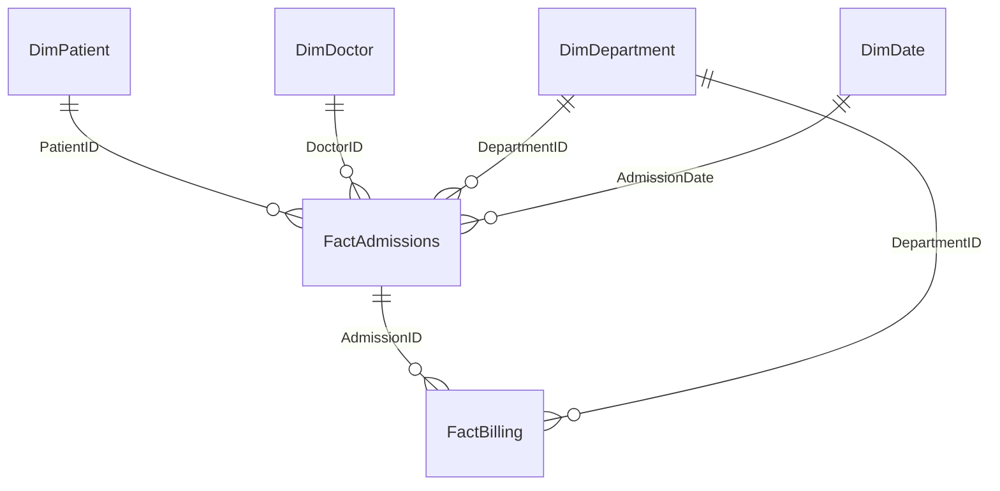

# Power BI — DAX Measures & Data Model

> ⭐ Portfolio project — measures built on the Gold layer star schema 
> (DimPatient, DimDoctor, DimDepartment, DimDate, FactAdmissions, FactBilling)

## Data Model Relationships



All relationships are **one-to-many, single direction**, from Dimension → Fact 
(star schema best practice — avoids ambiguous filter propagation).

---

## Core Measures

### 1. Total Patients
```dax
Total Patients = DISTINCTCOUNT(FactAdmissions[PatientID])
```
**Business need**: Executive dashboard headline KPI.

---

### 2. Total Revenue
```dax
Total Revenue = 
CALCULATE(
    SUM(FactBilling[Amount]),
    FactBilling[PaymentStatus] = "Paid"
)
```
**Business need**: Only counts collected revenue, excludes pending bills.

---

### 3. Outstanding Revenue
```dax
Outstanding Revenue = 
CALCULATE(
    SUM(FactBilling[Amount]),
    FactBilling[PaymentStatus] = "Pending"
)
```

---

### 4. Average Length of Stay
```dax
Avg Length of Stay = 
AVERAGE(FactAdmissions[LengthOfStay_Days])
```

---

### 5. Bed Occupancy % (simplified demo logic)
```dax
Bed Occupancy % = 
DIVIDE(
    DISTINCTCOUNT(FactAdmissions[BedNumber]),
    100,          -- assume 100 total beds in the demo hospital
    0
)
```
**Interview note**: In a real system, total bed capacity would come from a 
dedicated `DimBed` or hospital capacity table — here it's simplified for the demo.

---

### 6. Total Admissions
```dax
Total Admissions = COUNTROWS(FactAdmissions)
```

---

### 7. Emergency Admission %
```dax
Emergency Admission % = 
DIVIDE(
    CALCULATE(COUNTROWS(FactAdmissions), FactAdmissions[AdmissionType] = "Emergency"),
    [Total Admissions],
    0
)
```

---

## Time Intelligence Measures

### 8. Revenue MTD (Month-to-Date)
```dax
Revenue MTD = 
CALCULATE(
    [Total Revenue],
    DATESMTD(DimDate[DateKey])
)
```

### 9. Revenue YTD (Year-to-Date)
```dax
Revenue YTD = 
CALCULATE(
    [Total Revenue],
    DATESYTD(DimDate[DateKey])
)
```

### 10. Revenue — Previous Month
```dax
Revenue PM = 
CALCULATE(
    [Total Revenue],
    DATEADD(DimDate[DateKey], -1, MONTH)
)
```

### 11. Revenue Growth % (MoM)
```dax
Revenue Growth % = 
DIVIDE(
    [Total Revenue] - [Revenue PM],
    [Revenue PM],
    0
)
```

---

## Ranking & Top-N Measures

### 12. Rank Departments by Revenue
```dax
Department Revenue Rank = 
RANKX(
    ALL(DimDepartment[DepartmentName]),
    [Total Revenue],
    ,
    DESC
)
```

### 13. Top 3 Doctors by Patient Load
```dax
Doctor Patient Rank = 
RANKX(
    ALL(DimDoctor[DoctorName]),
    [Total Admissions],
    ,
    DESC
)
```

---

## Dynamic Title Measure (for dashboard polish)
```dax
Dashboard Title = 
"Hospital Analytics — " & 
SELECTEDVALUE(DimDate[Year], "All Years") & 
" Overview"
```

---

## Row-Level Security (RLS)

RLS role example — restrict department heads to see only their own department:

```dax
[Department RLS Filter]
DimDepartment[HeadDoctorID] = USERPRINCIPALNAME()
```
Applied on the `DimDepartment` table → propagates to `FactAdmissions` and 
`FactBilling` through the star schema relationships.

---

## Performance Optimization Notes
- Used **star schema** (not snowflake) to minimize relationship hops
- Marked `DimDate` as an official **Date Table** in Power BI for Time Intelligence to work
- Avoided calculated columns where measures could achieve the same result (measures are more memory-efficient)
- Used `DIVIDE()` instead of `/` throughout to safely handle divide-by-zero
- Disabled auto date/time in Power BI options (reduces model size)

---

## Interview Explanation (30-second version)
*"I built a star schema semantic model on the Gold layer tables, with DAX 
measures covering core KPIs, time intelligence (MTD/YTD/growth), ranking 
logic with RANKX, and row-level security scoped to department heads."*
